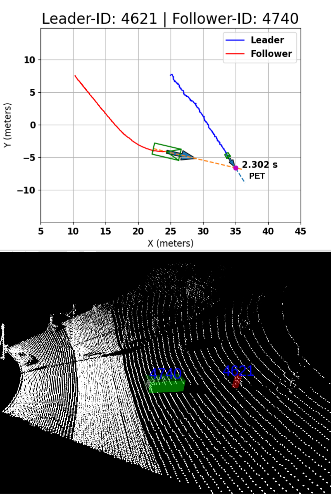
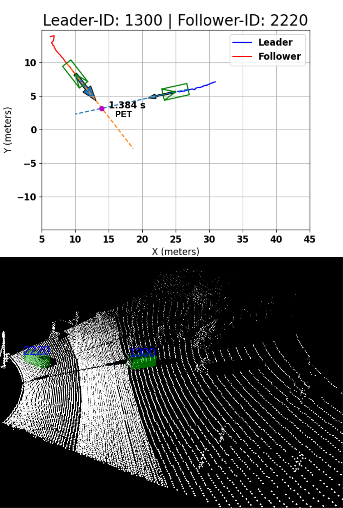

# vru-intersection-safety
This is the official repository for the SAE 24 paper [Evaluating Safety Metrics for Vulnerable Road Users at Urban Traffic Intersections Using High-Density Infrastructure LiDAR System](https://www.sae.org/publications/technical-papers/content/2024-01-2641/).

The scripts were successfully tested on an Ubuntu 22.04 system with Intel i9 13th Gen processor, NVIDIA RTX 4090 GPU and 500 GB of disk space.

Project resources can be found at [this](https://arizonastateu-my.sharepoint.com/personal/prath4_sundevils_asu_edu/_layouts/15/onedrive.aspx?id=%2Fpersonal%2Fprath4%5Fsundevils%5Fasu%5Fedu%2FDocuments%2FSAE%5FWCX%5F2024%5FScenarios&ga=1) link.

<div style="display:flex;">
  
  
</div>

## setup conda env
Create conda environemt with Python 3.10.6 and use `pip_list.txt` and `conda_list.txt` as reference for required packages and their versions. 

## install MMDetection3D
Install mmdet3d following [this](https://mmdetection3d.readthedocs.io/en/latest/get_started.html) link.

## install ROS2
Install ROS2 following [this](https://docs.ros.org/en/humble/Installation/Ubuntu-Install-Debians.html) link.
Install `conda install -c conda-forge libstdcxx-ng` in your conda env to make it compatible with `rclpy`.

## download the PV-RCNN checkpoint
Download the checkpoint from [this](https://download.openmmlab.com/mmdetection3d/v1.1.0_models/pv_rcnn/pv_rcnn_8xb2-80e_kitti-3d-3class/pv_rcnn_8xb2-80e_kitti-3d-3class_20221117_234428-b384d22f.pth) and move it inside `scripts/mmdet3d/`

## setup local environment
Create `Datasets` folder inside home.
```
mkdir -p ~/Datasets/Hesai/
```
Move `hesai_mill_ave_1` and `hesai_mill_ave_4` folders from resources inside `~/Datasets/Hesai/` folder. Only these 2 out of 4 datasets have been released.

## run detection and tracking
Tracking results can be genertated using the following script. This will generate a file `tracking_results.json`. Precomputed results are available in resources folder for all the 4 datasets.
```
# run from project root folder. specify your user in the script before running.
python mmdet3d_pipeline.py

# visualize tracklets in 3D pointcloud.
rviz2 -d scripts/rviz/hesai_viz.rviz
```

Specific entity interactions and metrics evaluation can be visualized using the following script. In the previous step, look at the rviz screen to point out tracking IDs of two entities of interest and specify them in the script to visualize their interaction.
```
# run from project root folder. specify your user in the script before running. specify data_id (1 for millave_1 and 4 for millave_4) in the script before running. keep the rviz screen open to see the interaction in 3D pointcloud.
python safety_metrics_viz.py
```

Quantitative results for each dataset can be generated from the tracking results using the following script.
```
# run from project root folder. specify your user in the script before running.
python safety_metrics_stats.py
```

## note
This repository only contains the offline scripts supporting the results showcased in the paper. Online metrics evaluation scripts will be released in future.

